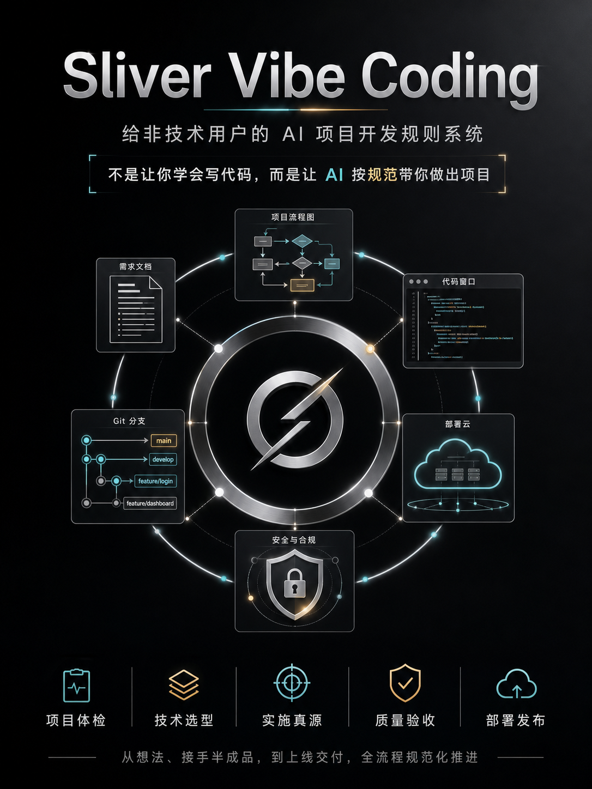

# Sliver Vibe Coding



面向非技术用户的 AI 项目开发治理 skill。

它不是一套“让用户自己学会写代码”的教程，而是一套给 AI 使用的项目开发规则、提问规则、技术决策规则、验收规则和防跑偏规则。目标是让完全没有技术背景的用户，也能在 AI 引导下从想法、接手半成品项目、功能开发、质量验收到部署发布，尽量按规范推进。

它是项目治理层 skill，不是深度工程执行 skill。普通 bug、局部 UI、单文件改动、单测失败会先做轻量适配评估；如果没有治理风险，就按普通工程任务窄修窄验，不强制套完整项目治理流程。

技术选型会先判断平台能力、前端设计系统、单运行时优先级和跨语言成本。不会把低约束样式工具、临时组件片段、Web 无法覆盖的本地能力，或多语言后端组合直接当成默认方案。

仓库内置空项目和半路接管模板，并提供项目 guardrail 脚本，用来检查用户项目里的 `AGENTS.md`、内部真源、架构 owner、验收证据和明显漂移标记是否真正落地。它们是当前公开 skill 的一部分，不需要再安装第二套 workflow。

## 这一版重点加强了什么

- 自然语言自动路由：用户可以直接说“项目跑不起来”“我接手了一个项目”“我要加会员付费”“上下文太长”，不需要记 slash command。
- 普通工程任务先评估再处理：修 bug、局部 UI、单文件改动不会被强行套完整治理，但如果碰到架构、数据、权限、支付、部署、真源缺失，会自动升级。
- 空项目和半路项目都能进入：从零项目用 bootstrap 模板，已有项目先只读审计，再用 adoption 模板建立当前真源。
- Git 保护更细：初始化、`.gitignore`、内部资料、参考项目库、远程地址配置、推送审批、回滚、reset、revert 都必须先做风险判断。
- 混合 commit 回滚保护：一个 commit 里混了多个功能时，不能直接整 commit revert，要先判断用户到底想撤哪个功能，再按文件或 hunk 拆。
- 技术选型更保守：优先选择 AI 熟悉、文档清楚、强规范、少从零搭架子的主路线；资料不足时先补资料，不急着吐技术栈。
- 交接不中断：上下文过长或要换 AI 时，会生成带路径、Git 状态、验证证据、风险和下一步命令的交接文本。

## 适合谁

- 完全没有技术背景，但想用 AI 做出一个真实项目的人。
- 已经让 AI 写了一半项目，但项目跑不起来、文件混乱、功能真假难辨的人。
- 想让 AI 帮自己做技术选型、架构、前端、后端、数据库、第三方接入、发布上线的人。
- 不想靠一句“帮我写代码”硬冲，而是希望 AI 多问、多判断、多验收、多保护项目的人。

## 解决什么问题

这个 skill 会要求 AI 主动处理这些小白最容易卡住的问题：

- 项目从哪里开始，先做什么，后做什么。
- 现有项目能不能半路接管，而不是必须从零开始。
- 没有 `dev-docs`、开发资料混乱、真源文档缺失时怎么处理。
- 技术栈应该怎么选，为什么只推荐一个主路线。
- 什么时候不能直接写代码，必须先做实施真源。
- 功能开发前会不会动到底层架构、数据库、权限、支付、部署。
- 第三方 API、SDK、OAuth、支付、AI 服务是否需要查官方文档。
- Git、`.gitignore`、密钥、内部资料、AGENTS 宪法、参考项目库怎么保护。
- 回滚、revert、reset 会不会误删用户真正要保留的改动。
- AI 写乱、重复文件、mock 假数据、假成功、报错循环怎么救。
- 用户不会验收时，如何变成点击路径、截图证据、通过/失败判断。
- 上下文太长或要交给另一个 AI 时，如何生成可复制的交接文本。
- 上线前如何检查环境变量、密钥、数据库迁移、回滚、监控、成本和公开访问风险。

## 使用方式

安装到 Codex skills 目录后，在对话里直接用自然语言描述需求即可，不要求用户记住命令。

示例：

```text
Use $sliver-vibe-coding to 帮我从零做一个客户管理系统。
Use $sliver-vibe-coding to 接管这个项目，告诉我现在该先做什么。
Use $sliver-vibe-coding to 项目跑不起来，先帮我救一下。
Use $sliver-vibe-coding to 我要加会员付费功能，先评估能不能直接做。
Use $sliver-vibe-coding to 上下文太长，给我一份新窗口继续的交接。
Use $sliver-vibe-coding to 上线前帮我做发布准备。
```

skill 内部有 `/项目体检`、`/环境启动`、`/技术选型`、`/功能开工评估`、`/收费权益设计`、`/质量验收`、`/上下文交接`、`/部署路线` 等路由标签，但这些是给 AI 调度流程用的。普通用户可以不输入这些命令。

## 常用自然语言入口

| 用户可以直接说 | skill 会优先做什么 |
| --- | --- |
| 我想从零做一个项目 | 补齐立项、用户、MVP、边界和第一闭环 |
| 我接手了一个写了一半的项目 | 只读体检现状，判断从哪一步接入 |
| 项目跑不起来 | 建立启动基线，先找启动、依赖、环境变量和端口问题 |
| 帮我选技术栈 | 先检查项目资料是否足够，再给一个主推荐和拒绝理由 |
| 我要开始做这个功能 | 评估会不会动架构、数据库、权限、支付、部署或第三方 |
| 没有实施真源，可以直接开发吗 | 先补当前阶段真源，让用户确认需求后再开发 |
| 要接 API、SDK、OAuth、支付、AI 服务 | 查官方文档和项目证据，落到第三方接入真源 |
| 没有 git / 内部资料不能推 / 配远程仓库 | 建立 Git、忽略规则、双仓或私密资料保护边界 |
| 我要回滚 / revert 这个 commit | 先做损失审计和意图分类，禁止直接整 commit 撤销 |
| 上下文太长，换窗口继续 | 生成可复制交接，包含现状、变更、验证、风险和下一步 |

## 能力边界

- 它不是替代工程师的万能执行器，而是让 AI 在小白项目里先做正确判断、正确提问、正确留证据。
- 它不会因为任务小就完全不接管；会先做轻量评估，确认没有治理风险后再窄修窄验。
- 它不会因为任务大就直接开写；标准和高风险功能必须先有实施真源、架构判断和用户确认。
- 内置模板只是起点，不能原样复制成项目真源；必须结合用户项目、文件路径、命令、owner 和验证证据改写。
- `check_project_guardrails.py` 只能检查结构和明显漂移，不替代真实启动、测试、UI、API、数据库、安全、部署或用户验收。

## 微信群

### 二群


二维码有效期以图片显示为准，失效后替换 `assets/wechat-group-2.jpg`。

### 一群


二维码有效期以图片显示为准，失效后替换 `assets/wechat-group.jpg`。

## 安装

推荐使用 HTTPS，适合没有配置 Gitee SSH Key 的用户：

```bash
git clone https://gitee.com/sliver-ring_admin/sliver-vibe-coding.git ~/.codex/skills/sliver-vibe-coding
```

已经配置 Gitee SSH Key 的用户也可以用 SSH：

```bash
git clone git@gitee.com:sliver-ring_admin/sliver-vibe-coding.git ~/.codex/skills/sliver-vibe-coding
```

如果已经克隆到别的位置，也可以移动整个 `sliver-vibe-coding` 目录到：

```text
~/.codex/skills/sliver-vibe-coding
```

固定到当前提交：

```bash
cd ~/.codex/skills/sliver-vibe-coding
git rev-parse HEAD
git checkout <上一步输出的commit-hash>
```

如果仓库已经发布 tag，也可以把 `<上一步输出的commit-hash>` 换成具体 tag，例如 `v0.1.0`。升级和兼容说明见 [COMPATIBILITY.md](COMPATIBILITY.md)，版本变化见 [CHANGELOG.md](CHANGELOG.md)。

## 目录结构

```text
sliver-vibe-coding/
├── VERSION
├── CHANGELOG.md
├── COMPATIBILITY.md
├── SKILL.md
├── agents/
│   └── openai.yaml
├── scripts/
│   ├── validate_skill.py
│   ├── evaluate_routes.py
│   └── check_project_guardrails.py
├── tests/
│   └── route-eval-cases.json
├── assets/
│   ├── project-bootstrap/
│   ├── project-adoption/
│   ├── sliver-vibe-coding-poster.png
│   ├── wechat-group-2.jpg
│   └── wechat-group.jpg
└── references/
    ├── project-flow.md
    ├── project-intake.md
    ├── project-templates.md
    ├── context-handoff.md
    ├── task-risk-gates.md
    ├── commands.md
    ├── routes-intake.md
    ├── routes-rescue.md
    ├── routes-git.md
    ├── routes-feature.md
    ├── routes-backend.md
    ├── routes-validation.md
    ├── routes-release.md
    ├── routes-constitution.md
    ├── question-bank.md
    ├── tech-stack.md
    ├── frontend-skeleton.md
    ├── database-design.md
    ├── backend-boundary.md
    ├── backend-skeleton.md
    ├── third-party-integration.md
    ├── monetization-and-entitlements.md
    ├── beginner-failure-modes.md
    ├── security.md
    ├── git-and-delivery.md
    ├── agent-constitution.md
    └── agent-constitution-template.md
```

## 核心工作流

默认顺序是：

1. 确认项目目录、开发资料真源和 Git 保护。
2. 建立启动基线，确认项目能不能跑起来。
3. 补齐立项、用户、MVP、功能边界和不做什么。
4. 拆分复杂功能和大阶段。
5. 只推荐一个技术路线，并说明拒绝其他路线的原因。
6. 建立项目架构和 agent 宪法。
7. 按需要建立前端、数据库、后端、安全基础。
8. 为当前阶段写实施真源，再按子阶段开发。
9. 做用户验收、质量验收、项目 guardrail、Git checkpoint。
10. 上下文过大或换 agent 时生成交接。
11. 上线前做部署路线、发布准备和运维交接。

已有项目不会被强行重来。skill 会先做只读体检，找到当前项目最早缺失或不稳定的环节，再选择下一步。

## 验证

本仓库自带校验脚本，不依赖 PyYAML 或其他第三方包：

```bash
python3 scripts/validate_skill.py
python3 scripts/evaluate_routes.py
```

也可以用你本机实际安装的官方 skill 校验脚本检查基础结构：

```bash
python3 /path/to/skill-creator/scripts/quick_validate.py /path/to/sliver-vibe-coding
```

官方脚本路径在不同 Codex/Claude 环境里可能不同；本仓库 CI 不依赖该命令。当前要求：`SKILL.md` 的 frontmatter 有效，执行路由不再依赖单个大 `commands.md`，引用文件在仓库内，普通工程/轻量/标准/高风险门禁存在，安装和版本治理说明完整，README 只作为仓库说明，不作为 skill 运行依赖。路由测试会检查自然语言触发词和全路由覆盖，但仍不等同于完整人工评测。

检查用户项目是否真正落地了治理真源时，用：

```bash
python3 scripts/check_project_guardrails.py /path/to/user-project --mode bootstrap
python3 scripts/check_project_guardrails.py /path/to/user-project --mode adoption
python3 scripts/check_project_guardrails.py /path/to/user-project --mode constitution
python3 scripts/check_project_guardrails.py /path/to/user-project --mode stage --stage-file dev-docs/stages/current-stage.md
```

这个脚本只做结构和明显漂移检查，不替代真实启动、测试、UI、API、数据库、安全或用户验收。

## 许可证

本项目采用 Apache License 2.0 开源许可，SPDX 标识为 `Apache-2.0`。完整许可文本见 [LICENSE](LICENSE)。
